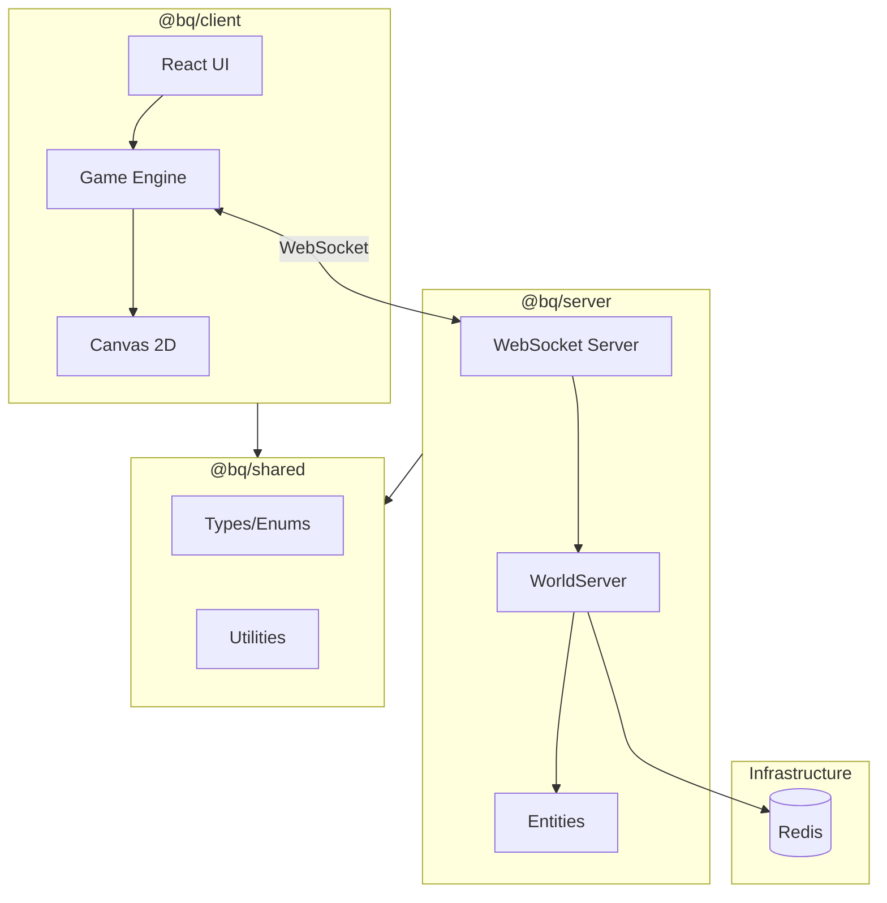

# Architecture

This document describes the high-level architecture of the BrowserQuest modernized codebase.

## Overview



## Packages

### `@bq/client`
The game client built with React 19 and Vite 6.

| Component | Purpose |
|-----------|---------|
| `Game.ts` | Main game loop, orchestrates subsystems |
| `Renderer.ts` | Canvas 2D rendering |
| `Network.ts` | WebSocket client |
| `Input.ts` | Keyboard/mouse handling |
| `EntityManager.ts` | Entity state management |
| `Map.ts` | Tile map loading and collision |

**UI Components (React):**
- `LoginScreen` - Character name input
- `HUD` - Health bar, chat, inventory
- `GameCanvas` - Canvas wrapper

### `@bq/server`
The game server built with Node.js and WebSocket.

| Component | Purpose |
|-----------|---------|
| `WorldServer.ts` | Game world logic, entity spawning, groups |
| `Player.ts` | Player connection handling, message routing |
| `Map.ts` | Server-side map data, collision, pathfinding |
| `Messages.ts` | Message serialization classes |
| `entities/` | Mob, Npc, Character, Entity base classes |

### `@bq/shared`
Shared code between client and server.

| File | Purpose |
|------|---------|
| `types.ts` | `MessageType`, `EntityKind`, `Orientation` enums |
| `utils.ts` | `randomInt`, `isPlayer`, `isMob`, etc. |
| `formulas.ts` | Damage calculations |
| `properties.ts` | Entity properties (HP, armor, weapons) |

## Message Protocol

Communication uses JSON arrays over WebSocket:

```typescript
// Client -> Server
[MessageType.HELLO, name, armor, weapon, avatar]
[MessageType.MOVE, x, y]
[MessageType.ATTACK, targetId]

// Server -> Client
[MessageType.WELCOME, id, name, x, y, kind]
[MessageType.SPAWN, ...entityState]
[MessageType.MOVE, entityId, x, y]
```

## Data Flow

1. **Connection**: Client connects via WebSocket, sends `HELLO`
2. **Welcome**: Server creates `Player`, assigns position, sends `WELCOME`
3. **World Sync**: Server sends `SPAWN` for nearby entities
4. **Movement**: Client sends `MOVE`, server validates, updates position
5. **Combat**: Client sends `ATTACK`, server calculates damage, broadcasts

## Deployment

```
┌─────────────────┐     ┌─────────────────┐     ┌─────────────────┐
│   Nginx (80)    │────▶│  Node.js (8000) │────▶│   Redis (6379)  │
│   Static Client │     │  Game Server    │     │   Session Store │
└─────────────────┘     └─────────────────┘     └─────────────────┘
```

Multi-stage Docker builds:
- **Client**: Build with Vite, serve with Nginx
- **Server**: Build with tsc, run with Node.js Alpine
